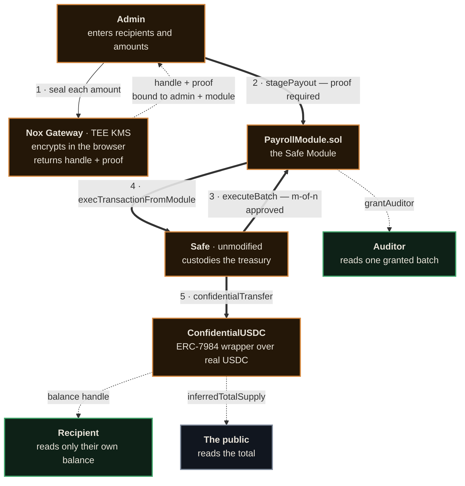

<div align="center">

# Confide

**Private payroll for public treasuries.**

A [Safe](https://safe.global) Module that pays contributors confidential salaries
out of a Safe treasury — powered by [iExec Nox](https://docs.noxprotocol.io) TEE compute.

[](https://confide-henna.vercel.app)
[](https://sepolia.etherscan.io)
[](https://sepolia.etherscan.io/address/0xb3BDc26Ae8E992Cb1BA793BfDc26CeF329bE5E0A)

</div>

---

> ### The claim, stated exactly
>
> **The treasury total stays public. Who gets paid, how much, and when is private.**

That sentence is the whole product, and it is deliberately narrow. Confide does
**not** claim hidden balances, anonymity, or untraceability — see
[What is *not* private](#what-is-not-private). Everything below is verifiable on
a public explorer without asking us for anything.

---

## Who can see what

| Actor | What they can read | Enforced by |
|:--|:--|:--|
| 🌐 **The public** | The treasury total. Nothing else. | `inferredTotalSupply()` — a plain ERC-20 balance read |
| 👤 **A contributor** | Their own balance, and only theirs. | The token calls `Nox.allow(newBalance, recipient)` on transfer |
| 🔍 **An auditor** | Every payout in **one granted batch**. | `grantAuditor(auditor, batchId)`, authorised by the Safe |
| 🏦 **The Safe's own owners** | **Not** the treasury's confidential balance. | Nox ACL is per-address and knows nothing about Safe ownership |

That last row is not an oversight. Nox grants decryption to the Safe *contract
address*; owning that Safe confers no decryption rights on your EOA. The
treasury's confidential balance is readable by nobody — which is why the
Treasury screen shows the **public** wrapper total and offers no decrypt button
next to the sealed one.

---

## Architecture



<div align="center">
<sub>

🟠 sealed — encrypted &nbsp;·&nbsp; 🟢 disclosed — decrypted **for you** &nbsp;·&nbsp; ⚪ public — anyone can read

The entire custody chain is amber. Only the total is public, and only a
recipient or a granted auditor turns anything green.

</sub>
</div>

**Funds never leave the Safe** until they land with a recipient. `PayrollModule`
is installed with `enableModule()` on a stock Safe — nothing is forked, patched,
or replaced. It adds a way to spend the treasury and removes none of the
existing ones.

---

## The lifecycle

```mermaid
sequenceDiagram
    autonumber
    participant Admin
    participant Nox as Nox Gateway · TEE
    participant Module as PayrollModule
    participant Safe
    participant Token as ConfidentialUSDC
    participant Bob as Recipient

    rect rgb(36, 23, 8)
    Note over Admin,Module: PROPOSE — one person, sealed
    Admin->>Nox: encryptInput(2500, "uint256", PayrollModule)
    Nox-->>Admin: handle + proof
    Admin->>Module: stagePayout(recipient, handle, proof)
    Note right of Module: msg.sender == owner == admin ✓
    end

    rect rgb(17, 22, 31)
    Note over Safe,Token: APPROVE + EXECUTE — m-of-n
    Safe->>Module: executeBatch(batchId)
    Note right of Module: no proof — the module<br/>already owns the handles
    Module->>Safe: execTransactionFromModule(...)
    Safe->>Token: confidentialTransfer(recipient, amount)
    end

    rect rgb(14, 33, 23)
    Note over Token,Bob: READ — only what you are entitled to
    Token-->>Bob: Nox.allow(newBalance, recipient)
    Bob->>Nox: decrypt(balanceHandle)
    Nox-->>Bob: 2500.00
    end
```



This maps exactly onto multisig semantics — **propose → approve → execute** —
and it is not a stylistic choice. It falls out of a hard constraint, described
next.

---

## The architectural crux: proof binding

Nox binds every encrypted input to **two** things: the contract that will use it,
and the account that encrypted it.

```solidity
require(appInProof   == msg.sender, "App mismatch");
require(ownerInProof == owner,      "Owner mismatch");
```

The SDK's `encryptInput()` **hardcodes the owner to the connected signer** — there
is no override parameter. And the convenient library helper `Nox.fromExternal()`
**hardcodes `msg.sender` as the owner** it validates against.

Together those mean a proof created by an admin EOA **can never be validated in a
call whose `msg.sender` is the Safe.** It reverts with `"Owner mismatch"`. Stock
`ERC7984Base.confidentialTransfer()` has exactly the same problem.

Confide turns that constraint into the product:

| Step | Called by | `msg.sender` | Proof? |
|:--|:--|:--|:--|
| `stagePayout` | Admin EOA, **directly** | admin EOA | ✅ required — and `msg.sender == owner`, so it validates |
| `executeBatch` | The Safe, m-of-n approved | Safe | ❌ none — the module already owns validated handles |

**No proof-bound call ever routes through the Safe.** Staging is a *proposal*, not
a payment; the Safe authorises an already-sealed batch. That is what a multisig
does anyway.

### The three ACL grants

Staging grants access to **three** parties, and all of them are load-bearing:

```solidity
Nox.allowThis(amount);     // 1. the module — reads it back in executeBatch
Nox.allow(amount, safe);   // 2. the Safe — it is the caller of the token
Nox.allow(amount, token);  // 3. the TOKEN — it executes the TEE operation
```

Grant 3 is the non-obvious one and it cost us a reverted batch. **Nox authorises
the contract that *executes* a TEE operation, not merely the caller that supplied
the handle.** `confidentialTransfer` internally runs `Nox.transfer(...)` with the
token as `msg.sender`, so NoxCompute checks the *token's* access to `amount`.
It is invisible in the library's own flow, because there `Nox.fromExternal` runs
*inside* the token and grants it transient access as a side effect. Confide
validates the proof in the module (it must — see above), so that implicit grant
never happens and the explicit one is required.

---

## Auditor disclosure

Confidentiality that cannot be selectively lifted is not a treasury product; it
is a black hole. `grantAuditor(auditor, batchId)` is `onlySafe` and calls
`Nox.allow(amount, auditor)` for every payout in the batch.

Disclosure is:

- **authorised by the Safe** (m-of-n), never by one admin;
- **scoped to a single batch**, not the whole ledger;
- **publicly auditable** — it emits `AuditorGranted(batchId, auditor, count)`, so
  the *fact* of a disclosure is on chain even though its contents are not;
- **narrower than it looks** — see below.

### What an auditor actually learns

An auditor is granted the **payout handles held by the module**, not recipients'
**balance** handles. Balance handles are granted to recipients by the token
itself and were never ours to give away.

> An auditor learns what each person was **paid in this batch** — not what they **hold**.

Verified in the walkthrough: a recipient breaking the seal on **their own payout
row** is refused, because they hold their balance handle and not the payout
record. The two scopes genuinely do not overlap.

### ⚠️ Grants are permanent

**Nox has no ACL revocation today.** Once an address is granted decrypt rights
over a batch, that access cannot be withdrawn. This is documented in the
contract's natspec and stated in the UI at the point of granting, rather than
glossed over. Choose auditor addresses deliberately.

---

## What is *not* private

Stated plainly, because a knowledgeable reader will find these anyway and a
product that hides them deserves the distrust:

| ⚠️ | Boundary |
|:--|:--|
| **Entry is public** | `wrap()` is an ordinary ERC-20 `transferFrom`. The amount deposited is visible. |
| **Recipients are public** | Only the **amount** is confidential. Who was paid is in the clear, by design — it is what makes the batch auditable. |
| **The anonymity set can be 1** | With a single organisation in the pool, an observer can infer the treasury balance exactly. We do not claim otherwise. |
| **Grants cannot be revoked** | See above. |
| **A "successful" transfer can move nothing** | ERC-7984 transfers **clamp to zero** on insufficient balance instead of reverting. Confide therefore asserts on decrypted deltas, never on transaction success. |

---

## Deployed on Ethereum Sepolia

| Contract | Address |
|:--|:--|
| **Safe** (treasury, unmodified) | [`0xb3BDc26Ae8E992Cb1BA793BfDc26CeF329bE5E0A`](https://sepolia.etherscan.io/address/0xb3BDc26Ae8E992Cb1BA793BfDc26CeF329bE5E0A) |
| **PayrollModule** | [`0xc508bd3aea398a1995280101f183dfeb89bba76b`](https://sepolia.etherscan.io/address/0xc508bd3aea398a1995280101f183dfeb89bba76b) |
| **ConfidentialUSDC** (ERC-7984) | [`0x5cbe8c86e72c06e8c13ddbb7ab11c011f25fb30d`](https://sepolia.etherscan.io/address/0x5cbe8c86e72c06e8c13ddbb7ab11c011f25fb30d) |
| Underlying — **real Circle USDC** | [`0x1c7D4B196Cb0C7B01d743Fbc6116a902379C7238`](https://sepolia.etherscan.io/address/0x1c7D4B196Cb0C7B01d743Fbc6116a902379C7238) |
| NoxCompute | [`0x24Ef36Ec5b626D7DCD09a98F3083c2758F0F77bF`](https://sepolia.etherscan.io/address/0x24Ef36Ec5b626D7DCD09a98F3083c2758F0F77bF) |

No mock data, no local node, no test doubles. The wrapper wraps **real Circle
USDC**, and the Safe is a canonical Safe deployment.

---

## Verified end to end

Walked in a browser against live Sepolia with four separate wallets — **16 checks,
including both failure paths.**

| | Check | Result |
|:--|:--|:--|
| ✅ | Treasury reads correctly with **no wallet connected** | public total exact, Safe balance sealed |
| ✅ | `approve` → `wrap` into the treasury | total rose by exactly the wrapped amount |
| ✅ | Wrap to self, re-decrypt | **exactly** `V + 2.000000` — asserted on the delta |
| ✅ | Stage two payouts, browser-side encryption | two rows, two distinct handles, **no amounts anywhere** |
| ✅ | `executeBatch` via the Safe | batch executed, open batch advanced |
| ✅ | `grantAuditor` via the Safe | `AuditorGranted(1, auditor, 2)` |
| ✅ | Recipient B decrypts own balance | **exactly 3.00** |
| ✅ | Recipient C decrypts own balance | **exactly 2.00** |
| ⛔ | **Recipient denied on a batch they were not granted** | refused — *including on their own payout row* |
| ⛔ | **Staging from a non-admin account** | blocked, with both addresses named |
| ✅ | Auditor decrypts the granted batch | **3.00 and 2.00**, matching what was staged |

The two ⛔ rows are the point. Without a visible refusal, "each person decrypts
only their own" is an assertion rather than a result.

---

## Run it yourself

**Requirements:** Node 20+, a Sepolia RPC, an account with Sepolia ETH and some
[Circle testnet USDC](https://faucet.circle.com).

```bash
git clone https://github.com/zaxcoraider/confide
cd confide
npm install

cp .env.example .env.local     # then fill in DEPLOYER_PRIVATE_KEY + SEPOLIA_RPC
```

### The frontend

```bash
npm run dev                    # http://localhost:3000
```

The three screens are **Treasury** (public total, wrap, fund the Safe), **Payroll**
(stage, execute, grant), and **Disclosure** (recipient and auditor views).
`/treasury` renders fully **without a wallet connected** — that is the public half
of the claim demonstrating itself.

### The proof scripts

Each script is re-runnable and prints its own verdict against real Sepolia.

```bash
npm run phase1    # wrap real USDC — total public, balance private
npm run phase2    # stage a batch, Safe-execute it, each recipient decrypts only their own
npm run phase3    # auditor decrypts a granted batch; a stranger is denied
```

Set `SKIP_SAFE_FUNDING=1` on `phase2`/`phase3` to reuse an already-funded Safe —
testnet USDC drips slowly and the Safe keeps its balance between runs.

### Diagnostics

Kept in the repo deliberately, because both reproduce real SDK failures:

```bash
npx tsx scripts/diagnose-clock.ts   # proves the decrypt clock-skew failure (see feedback.md)
npx tsx scripts/check-usdc.ts       # confirms the underlying token and your balance
```

---

## Repo layout

```
contracts/
  ConfidentialUSDC.sol    ERC-7984 wrapper over real Sepolia USDC
  PayrollModule.sol       the Safe Module — stage / execute / grantAuditor
app/
  page.tsx                the claim
  treasury/               public total, sealed Safe balance, wrap
  stage/                  stage · execute as the Safe · grant an auditor
  view/                   recipient and auditor disclosure, side by side
lib/
  nox.ts                  decrypt retry, clock-skew compensation  ← read first
  use-nox.ts              browser encrypt / decrypt hooks
  use-tx.ts               simulate → sign → 2 confirmations
  use-safe.ts             executing a call as the Safe
scripts/
  phase1.ts               wrap — total public, balance private
  phase2.ts               stage, Safe-execute, each recipient decrypts only their own
  phase3.ts               auditor granted, stranger denied
  diagnose-clock.ts       reproduction of the decrypt clock-skew failure
  check-usdc.ts           confirms the underlying token and your balance
feedback.md               friction encountered building on Nox
```

> **Read `lib/nox.ts` before touching any decrypt path.** It encodes two failure
> modes that are invisible from the call site and cost a full debugging cycle
> each. Do not hand-roll the retry, and do not "simplify away" the clock-skew
> compensation — it is the only reason decryption works on a machine whose clock
> is not perfectly synced.

---

## Tech

| Layer | Choice |
|:--|:--|
| Chain | Ethereum Sepolia (11155111) |
| TEE compute | iExec Nox — `nox-protocol-contracts@^0.2.4`, `@iexec-nox/handle@0.1.0-beta.13` |
| Confidential token | ERC-7984 via `nox-confidential-contracts@^0.2.2` |
| Multisig | Safe (canonical deployment) + `@safe-global/protocol-kit` — **unmodified** |
| Contracts | Solidity 0.8.35, Hardhat 3 |
| Frontend | Next.js 16 · React 19 · Tailwind 4 · wagmi 3 · viem |

Version pinning is not optional: `nox-protocol-contracts` **below 0.2.4 reverts
on Sepolia** with `"Nox: Unsupported chain"`, and `@iexec-nox/handle` below
`beta.13` has no Ethereum Sepolia entry at all. Both fail only at runtime.

---

## Feedback

[`feedback.md`](./feedback.md) records the friction of building on Nox as it
happened — including two failures that cost a debugging cycle each and are
invisible until they bite: a permission-shaped error that is really an RPC sync
race, and a decrypt path with **zero clock-skew tolerance** that reports the
resulting rejection as an authentication problem.

---

<div align="center">
<sub>Built for the iExec WTF Hackathon · Summer 2026</sub>
</div>
